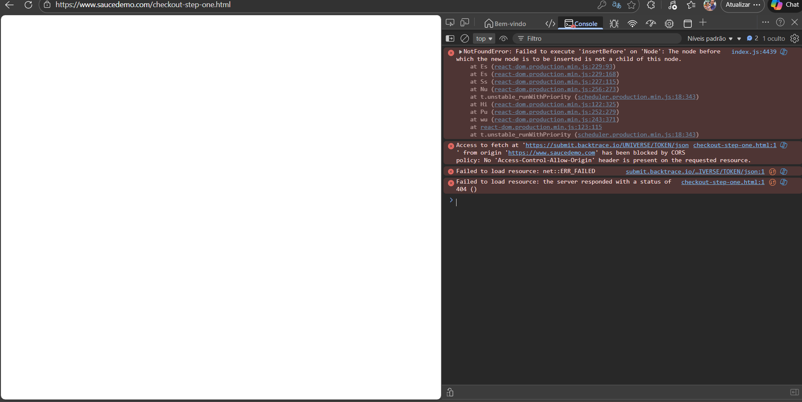
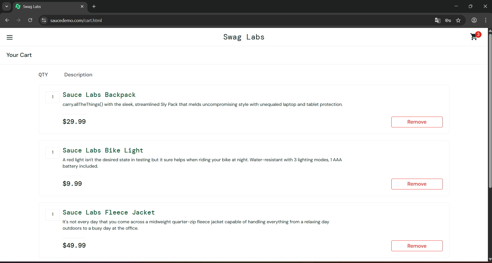
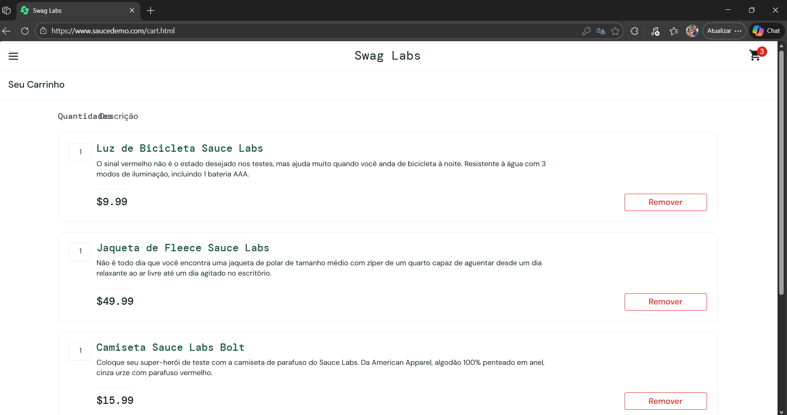
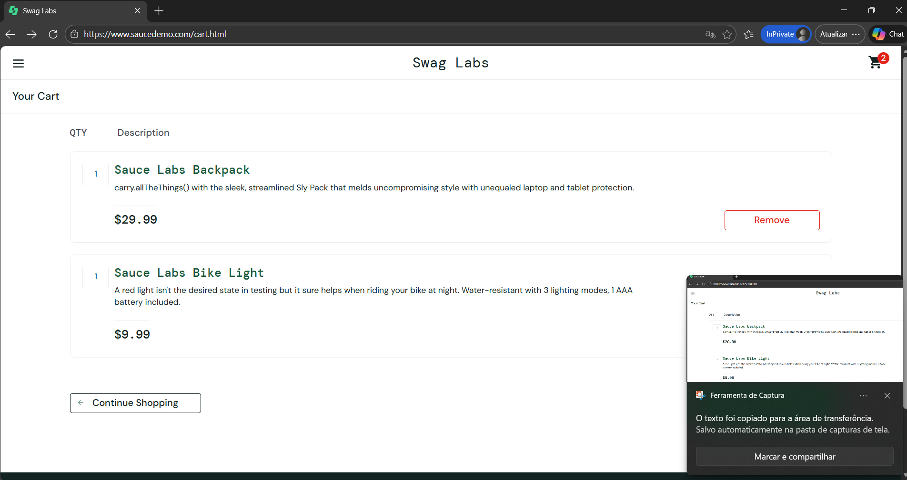

## BUG-01
Titulo: Tela branca ao acessar checkout no navegador Edge

Severidade: Alta
Prioridade> Alta 

Ambiente 
- Navegador: Microsoft Edge 
- Sistema: Windows 

Passos:
1. Acessar https://www.saucedemo.com/
2. Realizar login com usuario valido
3. Adicionar produto ao carrinho
4. Acessar o carrinho
5. iniciar o checkout
6. Preencher formulario

Resultado atual: 
Tela branca exibida ao tentar finalizar a compra no check-out

Resultado esperado:
Exibir página de visão geral da compra (Overview)

Evidências: 

Erros identificados:
- NotFoundError: Failed to execute 'insertBefore' on 'Node'
- blocked by CORS policy
- Failed to load resource (404)

Observações:
- Problema não ocorre no Chrome
- Problema nao ocorre em aba anônima

## BUG-02
Titulo: Imagens dos produtos não são exibidas no carrinho

Severidade: Media
Prioridade: Media 

Ambiente:
-Ambiente: Chrome/Edge
-Sistema: Windows

Pré-condição
-Usuario valido

Passos:
1. Acessar https://www.saucedemo.com/
2. Realizar login com usuario Valido
3. Adicionar produto ao carrinho
4. Acessar o carrinho

Resultado obtido: 
- Imagens dos produtos não são exibidas corretamente

Resultado esperado:
- Imagens de produto exibidos corretamente 

Evidencias:

Observações:
- Problema ocorre em múltiplos navegadores (Chrome e Edge)
- Problema também ocorre em navegação anônima

Relacionado ao teste:
- CT20
